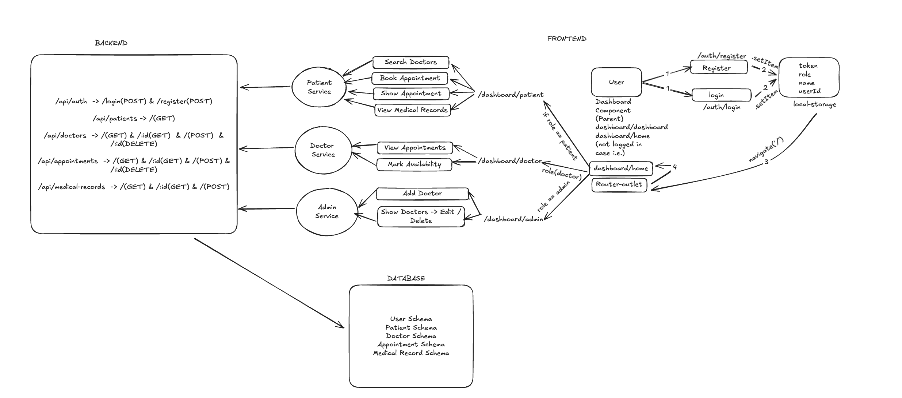

# Healthcare Management System (MEAN Stack)



## Project Overview

The Healthcare Management System is a **MEAN stack application** (MongoDB, Express.js, Angular, Node.js) designed to manage patients, doctors, and administrative workflows in a healthcare facility. The system provides role-based dashboards for **patients, doctors, and admin**, allowing efficient appointment management, doctor availability tracking, and user management.  

**Live Project:** [Project Link](https://frontend-nu-rust.vercel.app/)

---

## Features

### Patient
- Register, login, and manage profile
- Book appointments with doctors
- View upcoming and past appointments

### Doctor
- Register and login as a doctor
- Manage availability and schedule
- View all appointments assigned

### Admin
- Add, update, delete doctors
- View all doctors and manage their profiles

---

## Project Flow

The flow of the system is represented below:


---

## Technology Stack

- **Frontend:** Angular 20, Tailwind CSS  
- **Backend:** Node.js, Express.js  
- **Database:** MongoDB (with Mongoose)  
- **Authentication:** JWT Token-based authentication  
- **Deployment:** Localhost / Cloud (future support)

---

## Installation & Setup

1. **Clone the repository**
   ```bash
   git clone https://github.com/yourusername/healthcare-management.git
   cd healthcare-management
   ```

2. **Backend Setup**
   ```bash
   cd backend
   npm install
   #set environment variables
   npm start
   ```

3. **Frontend Setup**
   ```bash
   cd frontend
   npm install
   ng serve
   ```
4. **Access the Application**

    - **Frontend:** [http://localhost:4200](http://localhost:4200)  
    - **Backend API:** [http://localhost:5000/api](http://localhost:5000/api)
